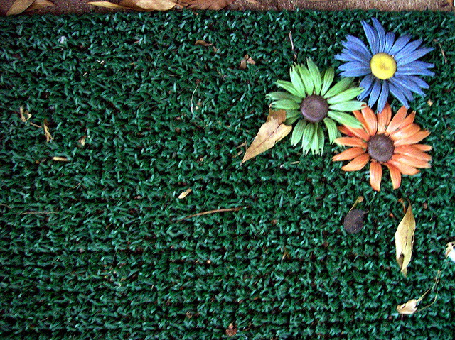

!SLIDE transition=fade subsection

# Why We’re Here #

!SLIDE transition=fade

# PNSQC #

.notes PNSQC is an intimidating conference.  Not only are you
respected engineers, but you’re also friends and neighbors.  It took
me a few years to work up the nerve to submit a talk.  With this
year’s theme, I felt like I had something to say.

!SLIDE transition=fade

# Achieving Quality in a Complex Environment #

.notes The theme of the conference this year is Achieving Quality in a
Complex Environment.  What associations does that trigger?  Maybe
something about testing?  That’d be doable if I’d spent the year doing
a peer-reviewed effectiveness study (I haven’t).  Besides, testing is
already well-covered here.

!SLIDE transition=fade

# The New Guy #

.notes So what has this year been about?  Well, I joined a new team at
work a couple of years ago, making me the new guy, or at least one of
’em.  Has anyone here joined a new project or team recently?  What was
it that helped you get oriented?

!SLIDE transition=fade

# Cultural Knowledge #

.notes For me, it was learning bits of cultural knowledge that helped
the most.  Not just coding standards or how to perform common tasks,
but a real feel for how we do things here.  Like any long-lived group
of collaborators, my teammates had a rich oral storytelling
tradition.

!SLIDE transition=fade

# Documentation #

.notes But this oral tradition has a bias toward preservation.
There’s a real emphasis on doing the legwork to find out how a system
works (“Ask Erik where to start,...”) and then make sure that others
benefit from your detective work (“... then add it to the docs.”)

!SLIDE transition=fade bullets incremental

* Culture / Team
* Artifact / Project
* Fragment / Subsystem

.notes That kind of knowledge preservation wasn’t just done at the
team level.  There were, of course, stashes of documentation for
specific projects: architecture diagrams and so on.  What I really
want to talk about today, though, is even narrower: the scope of a
single subsystem or software library.

!SLIDE transition=fade

# Software Spelunking #

.notes Does anyone go software spelunking?  Browsing through random
directories you can find on the server and wondering, “What’s this
do?”  What’d you find?

!SLIDE transition=fade center

.notes For one particular subsystem, I found a welcome mat of sorts.
In a single page, the author laid out a sixty-line example that showed
how to use most of the features of the library.  Over the next few
pages, he explained the example line by line.

!SLIDE transition=fade

# Three Types #

.notes The welcome-mat document was basically a tutorial, the first of
three document types that Jacob Kaplan-Moss (the Django docmeister)
says that big projects need.  The other types are low-level API
references and topic guides (the layer in between).  Today, we’ll be
talking mostly about tutorials and references.
