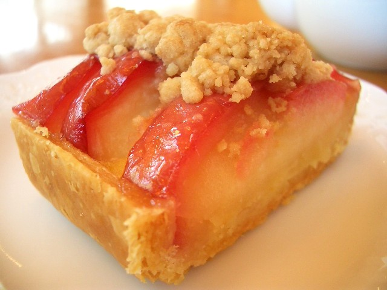
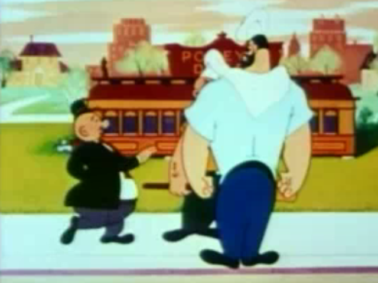

!SLIDE title-slide

# Document Your #
# Software Project! #
## ian.s.dees@tek.com ##

.notes Hi, I'm Ian.  I'm here to talk about software documentation,
specifically library documentation.

!SLIDE transition=fade center

.notes Admittedly, choosing this particular title is kind of like
calling a presentation "baseball" or "applie pie."

!SLIDE transition=fade center

# "Let's You and Him Fight" #

.notes Also, telling people something safe and obvious, with no stakes
in the game, would be akin to picking a fight between two strangers.
I'd much rather tell a few stories about how good documentation from
other people has helped me, and how I'm staying motivated to repay the
favor.

!SLIDE transition=fade bullets

* Why We're Here
* Document Misfits
* The Magazine Metaphor
* How to Get There
* A Few Tools
