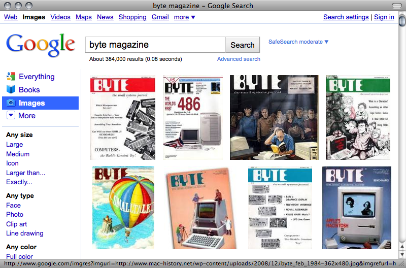

!SLIDE transition=fade center

.notes What was your favorite computer magazine when you were cutting
your teeth as a coder? COMPUTE!, BYTE, DDJ?  What did you like about
these?

!SLIDE transition=fade bullets

* Try it right away
* Techniques by example
* New ideas

.notes I liked the fact that there were programs you could type in
straight from the magazine.  I liked the way you could learn the
techniques in the articles by trying them out for real.  I liked the
exposure to new languages and technologies.
