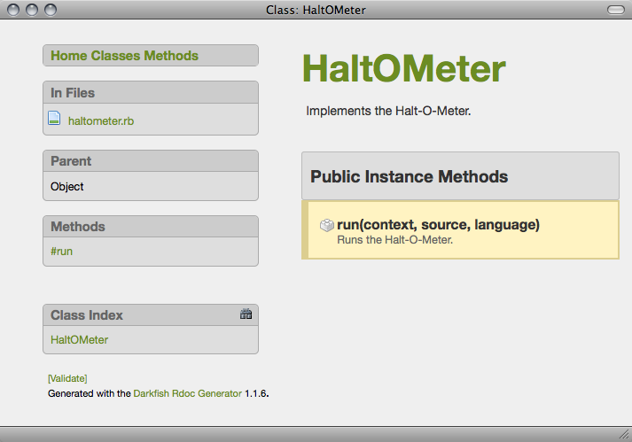
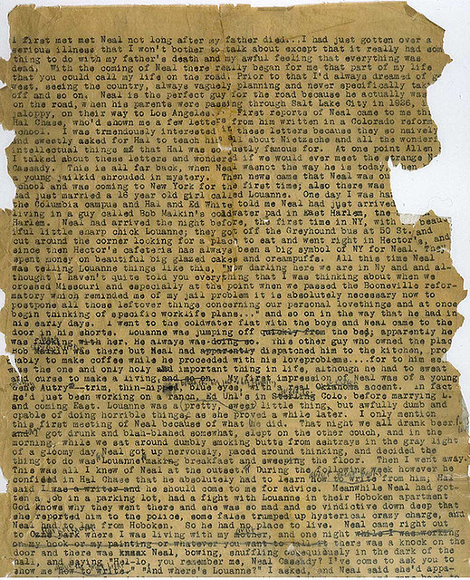

!SLIDE transition=fade subsection

# Document Misfits #

!SLIDE transition=fade center

# Invisible Ink #

!SLIDE transition=fade center

# Ghost Writer #

!SLIDE transition=fade

Auto-generated documentation is worse than
useless: it lets maintainers fool themselves into thinking they have
documentation, thus putting off actually writing good reference by
hand.

### Jacob Kaplan-Moss ###

!SLIDE transition=fade

	@@@ruby
	# Implements the Halt-O-Meter.
	#
	class HaltOMeter
	  # Runs the Halt-O-Meter.
	  #
	  def run(context, source, language)
	  end
	end

!SLIDE transition=fade center

!SLIDE transition=fade center

## One Document to Rule Them All ##

!SLIDE transition=fade center

# Ancient Scrolls #

