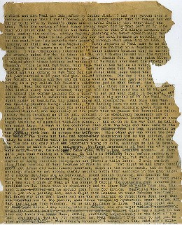

!SLIDE transition=fade subsection

# Document Misfits #

!SLIDE transition=fade center

# Invisible Ink #

.notes What kinds of things have gone wrong with documentation in your
experience?  One of the most common things I’ve seen is projects with
no docs at all.

!SLIDE transition=fade center

# Ghost Writer #

.notes The second is relying solely on documents generated
automatically from source code.

!SLIDE transition=fade

Auto-generated documentation is worse than
useless: it lets maintainers fool themselves into thinking they have
documentation, thus putting off actually writing good reference by
hand.

### Jacob Kaplan-Moss ###

.notes Kaplan-Moss is particularly tough on this kind of
documentation, and with good reason.  Just to pick on one of my
favorite languages: a lot of Ruby projects link straight from the home
page to a sea of class definitions with no information on what each
class is for or where to start.

!SLIDE transition=fade

	@@@ruby
	# Implements the Halt-O-Meter.
	#
	class HaltOMeter
	  # Runs the Halt-O-Meter.
	  #
	  def run(context, source, language)
	  end
	end

.notes Consider this example.  The source comments don’t tell us
anything we couldn’t have gotten from the class and method names.
For instance, they don’t tell us what these parameters mean.

!SLIDE transition=fade center

.notes And the result is a beautiful HTML page (complete with
validation link) with no content.  The fix is twofold: write enough in
the source comments for a reader to know how to use your class, and
provide an overview telling him where to start.  Both of these
solutions are manual; even if you’re generating docs automatically,
you still need to do some writing yourself.

!SLIDE transition=fade center

## One Document to Rule Them All ##

.notes At the other end of the spectrum, we have overdocumentation.
I’ve seen people throw a mass of inscrutable architecture diagrams and
outdated requirements documents into a central binder, far away from
the source code.  These can be informative as a historical record, but
they’re seldom helpful when it’s actually time to write software.

!SLIDE transition=fade center

# Ancient Scrolls #

.notes Documents go out of date, especially ones that are kept in a
central stash that no one remembers to look in.  Sometimes the text is
all right, but the source examples stop running with the latest
software.  Later, we’ll talk about ways to keep your example code
tested and updated.
