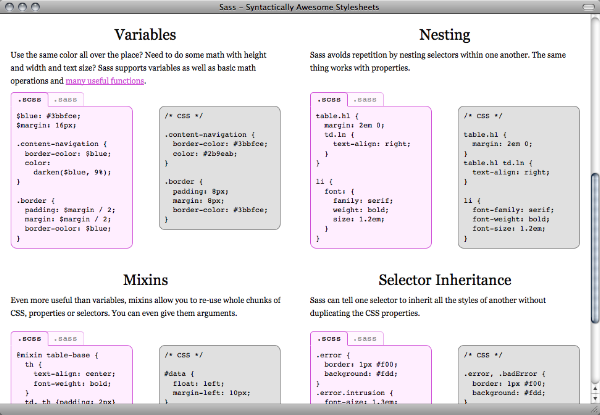
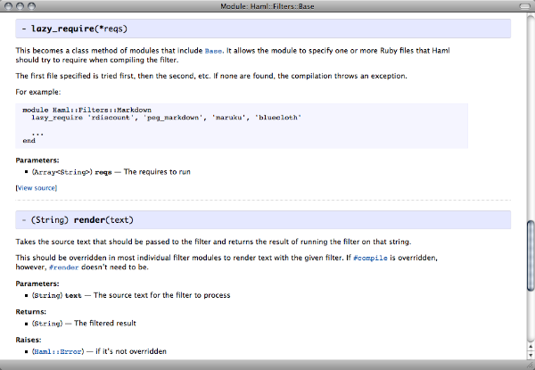

!SLIDE transition=fade subsection

# A Few Tools #

!SLIDE transition=fade bullets

# Humane Markup #

* Markdown
* Textile
* reStructuredText
* AsciiDoc

.notes Speaking of tools, here are a few ways to create code-friendly
documents.  First, there are the so-called humane markup languages.
These are like text you’d write in an e-mail message: dashes or equals
signs for underlining, stars for bulleted lists, and so on.

!SLIDE transition=fade smaller

	Plain Text and Its Relatives
	^^^^^^^^^^^^^^^^^^^^^^^^^^^^

	Don't underestimate the power of plain text. It can be read from
	the command line with no additional tools, sent around as e-mail,
	and tracked usefully with revision control tools. This includes
	the ``humane markup'' languages, such as Textile, Markdown,
	reStructuredText, and AsciiDoc. Using one of these formats means
	just writing like you'd normally do, and then adopting a few
	simple conventions for section titles, code excerpts, and so on.
	For example, here's how a README file might begin in
	reStructuredText:
	footnote:[http://docutils.sourceforge.net/rst.html]

	--------------------------------------------------------------------
	include::example.rst[]
	--------------------------------------------------------------------

.notes I wrote my paper for this conference in one of these formats,
AsciiDoc.  Here’s an excerpt.  As you can see, it’s just plain text
with a few conventions.  Notice that I can tie in source code that
lives in external files.

!SLIDE transition=fade center

.notes Here’s a bit of the PDF that came from this process.  The
fresh, tested code example from the external file is typeset right
into the printable documentation.

!SLIDE transition=fade bullets

# Machine-Friendly Markup #

* LaTeX
* RTF
* DocBook
* HTML

.notes If you’re already a whiz in one of the more
typesetting-oriented text languages like TeX or RTF, you should
absolutely use those.  Because they’re still somewhat text-based, it’s
easy enough to use a script to update sections that contain source
code.

!SLIDE transition=fade

# Word Processors #

.notes The welcome-mat document I mentioned earlier was a plain old
Word file.  All of the Big Three—Word, OpenOffice.org, and iWork—can
save to XML-based formats, which means it’s possible to update code
snippets automatically.  (See the snippetizer project on GitHub for an
iWork example.)

!SLIDE transition=fade

# Example: Sass #
## http://sass-lang.com ##

.notes The Sass project for generating CSS files is the kind of
documentation that’s not only readable, it’s also within our reach as
developers to create.

!SLIDE transition=fade center

.notes The main page begins with a three-line example for the
impatient, then explains what the library is and why you’d use it.

!SLIDE transition=fade center

.notes Further down the page are a bunch of real examples you’re
encouraged to try.

!SLIDE transition=fade center

.notes The Tutorials link takes you to a magazine-article length guide
that walks you step by step through installation and your first
creation.

!SLIDE transition=fade center

.notes The API documentation leads off with an equally lucid
walkthrough of the major parts of the system.  You have access to all
the class and method documentation—but you also get advice on where to
look first.

!SLIDE transition=fade center

.notes Once you’ve zoomed in on a particular method, this is what you
see.  Unlike our pathological Ruby example from earlier on, this text
discusses parameters, examples, and error handling.

!SLIDE transition=fade smaller

	## Features

	* Fully CSS3-compatible
	* Language extensions such as variables, nesting, and mixins
	* Many {Sass::Script::Functions useful functions} for
	  manipulating colors and other values
	* Advanced features like
	  [control directives](#control_directives) for libraries
	* Well-formatted, customizable output
	* [Firebug integration]
	  (https://addons.mozilla.org/en-US/firefox/addon/103988)

.notes Here’s a snippet of the raw text that’s checked into the source
tree, right alongside the code.  The format is Markdown, one of the
humane markup languages I mentioned earlier.

!SLIDE transition=fade small

# http://github.com/undees/pnsqc #

.notes This style of documentation is not only readable, it’s
achievable by us, the developers whose job it is to provide it.

.notes To see the paper or the slides for this presentation, please
visit the address above.

!SLIDE transition=fade smbullets

# Other Voices #

* http://jacobian.org/writing/great-documentation/what-to-write
* http://tom.preston-werner.com/2010/08/23/readme-driven-development.html
* http://railstips.org/blog/archives/2010/10/14/stop-googling

.notes Here’s the Jacob Kaplan-Moss article mentioned earlier, along
with a Tom Preston-Warner blog post on README-driven development.  For
a contrary (or orthogonal) point of view, see John Nunemaker’s
exhortation for people new to a sytem to jump straight into the code.

!SLIDE transition=fade smbullets

# Photo Credits #

* pie: http://www.flickr.com/photos/kankan/53973269
* Popeye: http://www.archive.org/details/spree_lunch
* welcome: http://www.flickr.com/photos/madame_furie/2624297545
* invisible: http://www.flickr.com/photos/bontempscharly/4352297633
* ghost: http://www.flickr.com/photos/cocreatr/2345627792
* ring: http://www.flickr.com/photos/garlandcannon/4918141830
* scroll: http://www.flickr.com/photos/emdot/4876145
